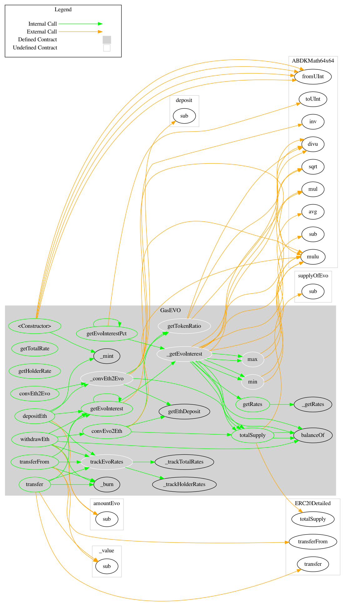

# GasEVO

> For the SDK Documentation please visit: [https://manifold-sdk.readthedocs.io/en/latest/](https://manifold-sdk.readthedocs.io/en/latest/)

```

```

## Protocol Diagram 



### 📡 Networks

The contract has been deployed to:

Rinkeby
- **Network 4**: `0x766291bE965E6Ba5E77892Ac70034f6B264AE7ea`

### 🎟 Events

#### Approval

|  Name   | Indexed |   Type    |
| :-----: | :-----: | :-------: |
|  owner  | `true`  | `address` |
| spender | `true`  | `address` |
|  value  | `false` | `uint256` |

#### BoughtEvo

|   Name    | Indexed |   Type    |
| :-------: | :-----: | :-------: |
|  seller   | `false` | `address` |
| evoAmount | `false` | `uint256` |
| ethAmount | `false` | `uint256` |

#### InterestOnEvo

|   Name    | Indexed |   Type    |
| :-------: | :-----: | :-------: |
|  sender   | `false` | `address` |
| evoAmount | `false` | `uint256` |
| interest  | `false` | `uint256` |

#### SoldEvo

|   Name    | Indexed |   Type    |
| :-------: | :-----: | :-------: |
|   buyer   | `false` | `address` |
| evoAmount | `false` | `uint256` |
| ethAmount | `false` | `uint256` |

#### Transfer

| Name  | Indexed |   Type    |
| :---: | :-----: | :-------: |
| from  | `true`  | `address` |
|  to   | `true`  | `address` |
| value | `false` | `uint256` |

## `DAY_IN_SECONDS`

> 👀 `view`

### → Returns

|     Name      |   Type    |
| :-----------: | :-------: |
| Not specified | `uint256` |

## `NUM_OF_RATES`

> 👀 `view`

### → Returns

|     Name      |   Type    |
| :-----------: | :-------: |
| Not specified | `uint256` |

## `allowance`

> 👀 `view`

### 🔎 Details

See {IERC20-allowance}.

### → Returns

|     Name      |   Type    |
| :-----------: | :-------: |
| Not specified | `uint256` |

## `approve`

> 👀 `nonpayable`

### 🔎 Details

See {IERC20-approve}. _ Requirements: _ - `spender` cannot be the zero address.

### → Returns

|     Name      |  Type  |
| :-----------: | :----: |
| Not specified | `bool` |

## `balanceOf`

> 👀 `view`

### 🔎 Details

See {IERC20-balanceOf}.

### → Returns

|     Name      |   Type    |
| :-----------: | :-------: |
| Not specified | `uint256` |

## `decimals`

> 👀 `view`

### 🔎 Details

Returns the number of decimals used to get its user representation. For example, if `decimals` equals `2`, a balance of `505` tokens should be displayed to a user as `5,05` (`505 / 10 ** 2`). _ Tokens usually opt for a value of 18, imitating the relationship between Ether and Wei. _ NOTE: This information is only used for _display_ purposes: it in no way affects any of the arithmetic of the contract, including {IERC20-balanceOf} and {IERC20-transfer}.

### → Returns

|     Name      |  Type   |
| :-----------: | :-----: |
| Not specified | `uint8` |

## `decreaseAllowance`

> 👀 `nonpayable`

### 🔎 Details

Atomically decreases the allowance granted to `spender` by the caller. _ This is an alternative to {approve} that can be used as a mitigation for problems described in {IERC20-approve}. _ Emits an {Approval} event indicating the updated allowance. _ Requirements: _ - `spender` cannot be the zero address. - `spender` must have allowance for the caller of at least `subtractedValue`.

### → Returns

|     Name      |  Type  |
| :-----------: | :----: |
| Not specified | `bool` |

## `increaseAllowance`

> 👀 `nonpayable`

### 🔎 Details

Atomically increases the allowance granted to `spender` by the caller. _ This is an alternative to {approve} that can be used as a mitigation for problems described in {IERC20-approve}. _ Emits an {Approval} event indicating the updated allowance. _ Requirements: _ - `spender` cannot be the zero address.

### → Returns

|     Name      |  Type  |
| :-----------: | :----: |
| Not specified | `bool` |

## `name`

> 👀 `view`

### 🔎 Details

Returns the name of the token.

### → Returns

|     Name      |   Type   |
| :-----------: | :------: |
| Not specified | `string` |

## `symbol`

> 👀 `view`

### 🔎 Details

Returns the symbol of the token, usually a shorter version of the name.

### → Returns

|     Name      |   Type   |
| :-----------: | :------: |
| Not specified | `string` |

## `totalSupply`

> 👀 `view`

### 🔎 Details

PRICE EQUILIBRIUM Prevent manifold amount of affecting the price equilibrium.

### → Returns

|     Name      |   Type    |
| :-----------: | :-------: |
| Not specified | `uint256` |

## `getEthDeposit`

> 👀 `view`

### 🔎 Details

INTROSPECT ETH DEPOSIT SUPPORTING THE TOKEN SUPPLY

### → Returns

|     Name      |   Type    |
| :-----------: | :-------: |
| Not specified | `uint256` |

## `getTotalRate`

> 👀 `view`

### 🔎 Details

INTROSPECT TOTAL RATE

### → Returns

|     Name      |   Type    |
| :-----------: | :-------: |
| Not specified | `uint256` |

## `getHolderRate`

> 👀 `view`

### 🔎 Details

INTROSPECT HOLDER&#39;S RATE

### → Returns

|     Name      |   Type    |
| :-----------: | :-------: |
| Not specified | `uint256` |

## `convEvo2Eth`

> 👀 `view`

### 🔎 Details

CONVERT $EVO to $ETH at the inner exchange rate (price), w/o applied interest.

### → Returns

|     Name      |   Type    |
| :-----------: | :-------: |
| Not specified | `uint256` |

## `convEth2Evo`

> 👀 `view`

### 🔎 Details

Convert $ETH to $EVO at the inner exchange rate (price), w/o applied interest.

### → Returns

|     Name      |   Type    |
| :-----------: | :-------: |
| Not specified | `uint256` |

## `getRates`

> 👀 `view`

### → Returns

|     Name      |   Type    |
| :-----------: | :-------: |
| Not specified | `uint256` |
| Not specified | `uint256` |

## `getEvoInterestPct`

> 👀 `view`

### → Returns

|     Name      |   Type    |
| :-----------: | :-------: |
| Not specified | `uint256` |

## `getEvoInterest`

> 👀 `view`

### → Returns

|     Name      |   Type    |
| :-----------: | :-------: |
| Not specified | `uint256` |

## `depositEth`

> 👀 `payable` | 💰 Payable

### 🔎 Details

Same as buying token at market price plus interest.

### → Returns

|     Name      |  Type  |
| :-----------: | :----: |
| Not specified | `bool` |

## `withdrawEth`

> 👀 `nonpayable`

### 🔎 Details

Same as selling token at market price minus interest.

### → Returns

|     Name      |  Type  |
| :-----------: | :----: |
| Not specified | `bool` |

## `transfer`

> 👀 `nonpayable`

### 🔎 Details

Extend to track transfers.

### → Returns

|     Name      |  Type  |
| :-----------: | :----: |
| Not specified | `bool` |

## `transferFrom`

> 👀 `nonpayable`

### 🔎 Details

Extend to track transfers.

### → Returns

|     Name      |  Type  |
| :-----------: | :----: |
| Not specified | `bool` |
# TestableGasEVO

>

```

```

### 🎟 Events

#### Approval

|  Name   | Indexed |   Type    |
| :-----: | :-----: | :-------: |
|  owner  | `true`  | `address` |
| spender | `true`  | `address` |
|  value  | `false` | `uint256` |

#### BoughtEvo

|   Name    | Indexed |   Type    |
| :-------: | :-----: | :-------: |
|  seller   | `false` | `address` |
| evoAmount | `false` | `uint256` |
| ethAmount | `false` | `uint256` |

#### InterestOnEvo

|   Name    | Indexed |   Type    |
| :-------: | :-----: | :-------: |
|  sender   | `false` | `address` |
| evoAmount | `false` | `uint256` |
| interest  | `false` | `uint256` |

#### Log

|  Name   | Indexed |   Type   |
| :-----: | :-----: | :------: |
| message | `false` | `string` |

#### LogUint

|  Name   | Indexed |   Type    |
| :-----: | :-----: | :-------: |
| message | `false` | `uint256` |

#### SoldEvo

|   Name    | Indexed |   Type    |
| :-------: | :-----: | :-------: |
|   buyer   | `false` | `address` |
| evoAmount | `false` | `uint256` |
| ethAmount | `false` | `uint256` |

#### Transfer

| Name  | Indexed |   Type    |
| :---: | :-----: | :-------: |
| from  | `true`  | `address` |
|  to   | `true`  | `address` |
| value | `false` | `uint256` |

## `DAY_IN_SECONDS`

> 👀 `view`

### → Returns

|     Name      |   Type    |
| :-----------: | :-------: |
| Not specified | `uint256` |

## `NUM_OF_RATES`

> 👀 `view`

### → Returns

|     Name      |   Type    |
| :-----------: | :-------: |
| Not specified | `uint256` |

## `allowance`

> 👀 `view`

### 🔎 Details

See {IERC20-allowance}.

### → Returns

|     Name      |   Type    |
| :-----------: | :-------: |
| Not specified | `uint256` |

## `approve`

> 👀 `nonpayable`

### 🔎 Details

See {IERC20-approve}. _ Requirements: _ - `spender` cannot be the zero address.

### → Returns

|     Name      |  Type  |
| :-----------: | :----: |
| Not specified | `bool` |

## `balanceOf`

> 👀 `view`

### 🔎 Details

See {IERC20-balanceOf}.

### → Returns

|     Name      |   Type    |
| :-----------: | :-------: |
| Not specified | `uint256` |

## `convEth2Evo`

> 👀 `view`

### 🔎 Details

Convert $ETH to $EVO at the inner exchange rate (price), w/o applied interest.

### → Returns

|     Name      |   Type    |
| :-----------: | :-------: |
| Not specified | `uint256` |

## `convEvo2Eth`

> 👀 `view`

### 🔎 Details

CONVERT $EVO to $ETH at the inner exchange rate (price), w/o applied interest.

### → Returns

|     Name      |   Type    |
| :-----------: | :-------: |
| Not specified | `uint256` |

## `decimals`

> 👀 `view`

### 🔎 Details

Returns the number of decimals used to get its user representation. For example, if `decimals` equals `2`, a balance of `505` tokens should be displayed to a user as `5,05` (`505 / 10 ** 2`). _ Tokens usually opt for a value of 18, imitating the relationship between Ether and Wei. _ NOTE: This information is only used for _display_ purposes: it in no way affects any of the arithmetic of the contract, including {IERC20-balanceOf} and {IERC20-transfer}.

### → Returns

|     Name      |  Type   |
| :-----------: | :-----: |
| Not specified | `uint8` |

## `decreaseAllowance`

> 👀 `nonpayable`

### 🔎 Details

Atomically decreases the allowance granted to `spender` by the caller. _ This is an alternative to {approve} that can be used as a mitigation for problems described in {IERC20-approve}. _ Emits an {Approval} event indicating the updated allowance. _ Requirements: _ - `spender` cannot be the zero address. - `spender` must have allowance for the caller of at least `subtractedValue`.

### → Returns

|     Name      |  Type  |
| :-----------: | :----: |
| Not specified | `bool` |

## `depositEth`

> 👀 `payable` | 💰 Payable

### 🔎 Details

Same as buying token at market price plus interest.

### → Returns

|     Name      |  Type  |
| :-----------: | :----: |
| Not specified | `bool` |

## `getEthDeposit`

> 👀 `view`

### 🔎 Details

INTROSPECT ETH DEPOSIT SUPPORTING THE TOKEN SUPPLY

### → Returns

|     Name      |   Type    |
| :-----------: | :-------: |
| Not specified | `uint256` |

## `getEvoInterest`

> 👀 `view`

### → Returns

|     Name      |   Type    |
| :-----------: | :-------: |
| Not specified | `uint256` |

## `getEvoInterestPct`

> 👀 `view`

### → Returns

|     Name      |   Type    |
| :-----------: | :-------: |
| Not specified | `uint256` |

## `getHolderRate`

> 👀 `view`

### 🔎 Details

INTROSPECT HOLDER&#39;S RATE

### → Returns

|     Name      |   Type    |
| :-----------: | :-------: |
| Not specified | `uint256` |

## `getRates`

> 👀 `view`

### → Returns

|     Name      |   Type    |
| :-----------: | :-------: |
| Not specified | `uint256` |
| Not specified | `uint256` |

## `getTotalRate`

> 👀 `view`

### 🔎 Details

INTROSPECT TOTAL RATE

### → Returns

|     Name      |   Type    |
| :-----------: | :-------: |
| Not specified | `uint256` |

## `increaseAllowance`

> 👀 `nonpayable`

### 🔎 Details

Atomically increases the allowance granted to `spender` by the caller. _ This is an alternative to {approve} that can be used as a mitigation for problems described in {IERC20-approve}. _ Emits an {Approval} event indicating the updated allowance. _ Requirements: _ - `spender` cannot be the zero address.

### → Returns

|     Name      |  Type  |
| :-----------: | :----: |
| Not specified | `bool` |

## `name`

> 👀 `view`

### 🔎 Details

Returns the name of the token.

### → Returns

|     Name      |   Type   |
| :-----------: | :------: |
| Not specified | `string` |

## `symbol`

> 👀 `view`

### 🔎 Details

Returns the symbol of the token, usually a shorter version of the name.

### → Returns

|     Name      |   Type   |
| :-----------: | :------: |
| Not specified | `string` |

## `totalSupply`

> 👀 `view`

### 🔎 Details

PRICE EQUILIBRIUM Prevent manifold amount of affecting the price equilibrium.

### → Returns

|     Name      |   Type    |
| :-----------: | :-------: |
| Not specified | `uint256` |

## `transfer`

> 👀 `nonpayable`

### 🔎 Details

Extend to track transfers.

### → Returns

|     Name      |  Type  |
| :-----------: | :----: |
| Not specified | `bool` |

## `transferFrom`

> 👀 `nonpayable`

### 🔎 Details

Extend to track transfers.

### → Returns

|     Name      |  Type  |
| :-----------: | :----: |
| Not specified | `bool` |

## `withdrawEth`

> 👀 `nonpayable`

### 🔎 Details

Same as selling token at market price minus interest.

### → Returns

|     Name      |  Type  |
| :-----------: | :----: |
| Not specified | `bool` |

## `log`

> 👀 `nonpayable`

## `logUint`

> 👀 `nonpayable`

## `trackTotalRates`

> 👀 `nonpayable`

### → Returns

|     Name      |  Type  |
| :-----------: | :----: |
| Not specified | `bool` |

## `trackHolderRates`

> 👀 `nonpayable`

### → Returns

|     Name      |  Type  |
| :-----------: | :----: |
| Not specified | `bool` |
# DebugHelper

>

```

```

### 🎟 Events

#### Log

|  Name   | Indexed |   Type   |
| :-----: | :-----: | :------: |
| message | `false` | `string` |

## `uint2str`

> 👀 `pure`

### → Returns

|     Name      |   Type   |
| :-----------: | :------: |
| Not specified | `string` |

## `int2str`

> 👀 `pure`

### → Returns

|     Name      |   Type   |
| :-----------: | :------: |
| Not specified | `string` |

## `i64x64ToStr`

> 👀 `pure`

### → Returns

|     Name      |   Type   |
| :-----------: | :------: |
| Not specified | `string` |
# ABDKMath64x64

>

```

```

### 📋 Notice

Smart contract library of mathematical functions operating with signed 64.64-bit fixed point numbers. Signed 64.64-bit fixed point number is basically a simple fraction whose numerator is signed 128-bit integer and denominator is 2^64. As long as denominator is always the same, there is no need to store it, thus in Solidity signed 64.64-bit fixed point numbers are represented by int128 type holding only the numerator.

### 📡 Networks

The contract has been deployed to:

- **Network 4**: `0xB26aC0C1B506D88BA3bCf4298236ab8381808D15`
